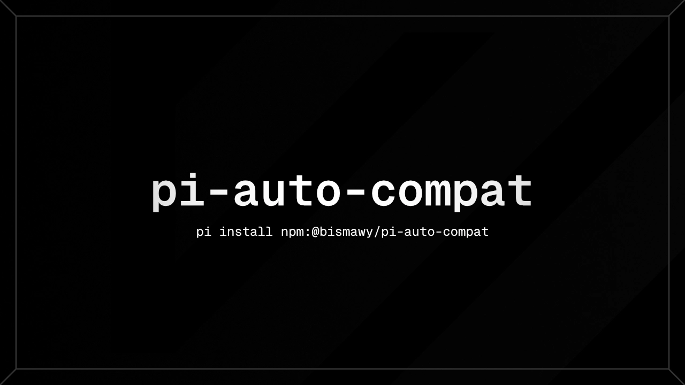

<div align="center">



# pi-auto-compat

Automatic `compat` flags self-healer for the [pi coding agent](https://github.com/earendil-works/pi-coding-agent) — patches missing model compatibility flags in `models.json` in-process, so caching, adaptive reasoning, and proxies just work.

[pi package](https://github.com/earendil-works/pi-coding-agent) · [npm](https://www.npmjs.com/package/@bismawy/pi-auto-compat) · [Issues](https://github.com/bismawy/pi-auto-compat/issues)


</div>

## What it does

Missing `compat` flags are the reason prompt caching silently fails, adaptive thinking doesn't kick in, or proxy sessions break. pi-auto-compat detects them and patches `models.json` automatically — no manual JSON editing, no compat warnings.

- **Auto-heals on the fly:** runs on `session_start`, `model_select`, and watches `models.json` for changes in real time.
- **In-process refresh:** applies updates via `modelRegistry.refresh()` — no session restart needed.
- **Aligned with `pi-cache-optimizer`:** mirrors the same detection rules, configuring long prompt caching, adaptive thinking (Claude 4.6+, Fable 5, Kimi K3), DeepSeek reasoning headers, session affinity, and thinking level maps for unmapped reasoning models.
- **Credential-safe:** only touches `compat` and `modelOverrides`. Never reads or writes API keys, tokens, or base URLs. Timestamped backups (max 3) before every write.

## Install

```bash
pi install npm:@bismawy/pi-auto-compat
```

Then run `/reload` in your Pi session (or restart Pi). Verify anytime with `/auto-compat`.

## How it works

<details>
<summary><b>Compatibility rules</b></summary>

| Category | Conditions | Applied flags |
| :--- | :--- | :--- |
| Universal cache retention | All models where unset (except built-in llama.cpp) | `supportsLongCacheRetention: true` |
| Adaptive generation | `anthropic-messages` + Opus/Sonnet ≥ 4.6, Fable ≥ 5, Kimi K3 | `forceAdaptiveThinking: true`, `allowEmptySignature: true` (K3) |
| DeepSeek-like models | `openai-completions` / `openai-responses` matching DeepSeek | `requiresReasoningContentOnAssistantMessages`, `thinkingFormat: "deepseek"`, session affinity |
| Claude on proxies | Claude models on OpenAI-compatible proxies | `cacheControlFormat: "anthropic"` |
| OpenAI-compatible proxies | Custom `openai-completions` endpoints | `sendSessionAffinityHeaders: true` (when undefined) |
| Unmapped reasoning | Reasoning models without declared thinking maps | `{ low, medium, high, xhigh }` thinkingLevelMap |

</details>

<details>
<summary><b>Placement strategy</b></summary>

- Channel-level parameters (session affinity, cache retention) go to the provider level; model-specific flags go under `models[].compat` or `modelOverrides`.
- When an extension registers custom providers with dynamic model lists, fixes are directed into `modelOverrides` so they take precedence over `models.json`.

</details>

<details>
<summary><b>Safety</b></summary>

- Never inspects or alters credentials — only additive `compat` patches. Existing values, including explicit `false`, are preserved.
- Rotates up to 3 timestamped backups (`models.json.backup.*`) before saving.

</details>

## License

Distributed under the **MIT** license.

## Developer

Developed and maintained by [Bisma](https://github.com/bismawy).
